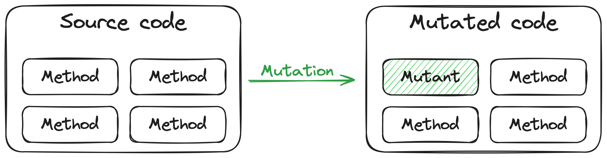
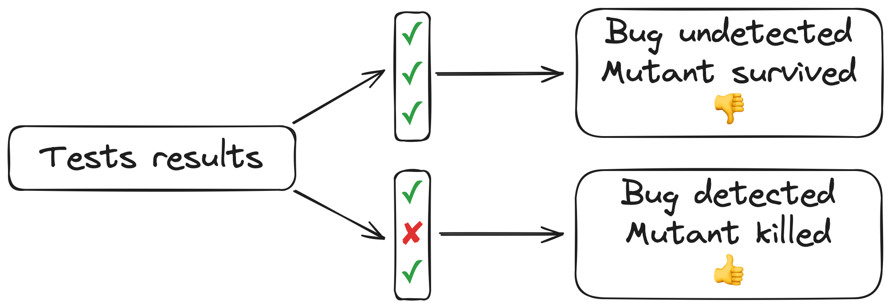
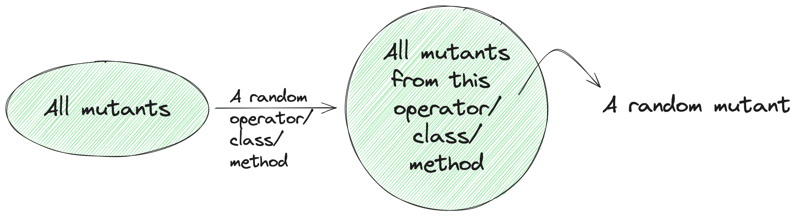
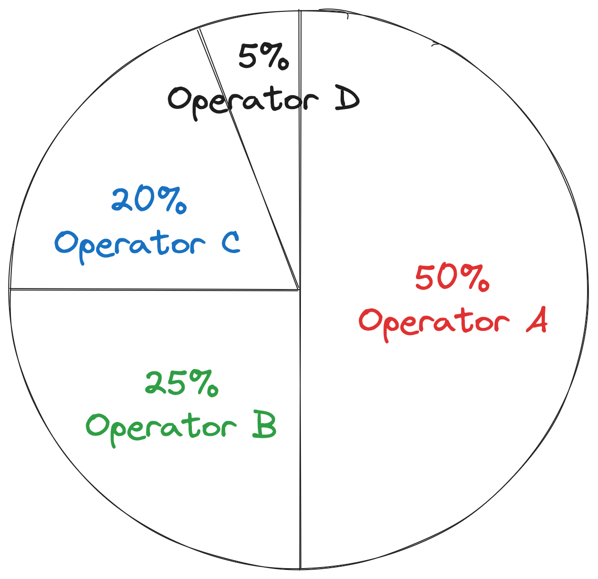
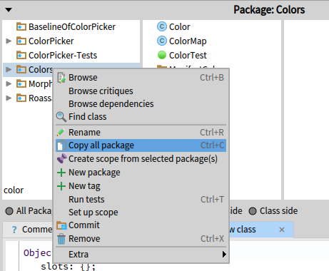
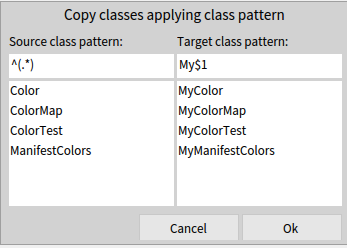
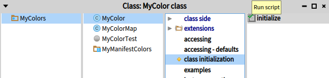
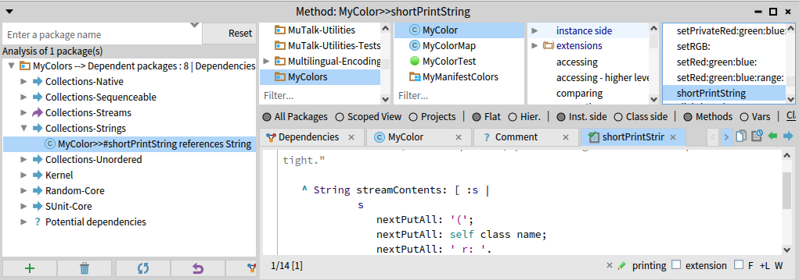

## MuTalk : A Mutation Testing Framework


_Authors:_ Iona Thomas -- Univ. Lille, Inria, CNRS, Centrale Lille, UMR 9189 CRIStAL, Lille, France -- iona.thomas@inria.fr and Pol Durieux -- Univ. Lille, Inria, CNRS, Centrale Lille, UMR 9189 CRIStAL, Lille, France -- pol.durieux@inria.fr

Mutation testing is a technique of measuring the quality and completeness of a test suite. While code coverage is used to make sure that tests execute each method or line of code, mutation testing evaluates the ability to detect new errors. It involves introducing errors and running the tests to see if they are detected. MuTalk is a flexible mutation framework that provides good default values for analyzing a test suite. It can be customized to fit specific domains or projects.
In this chapter we will discuss :
- 1. Introduction to Mutation Testing
- 2. How to use MuTalk / Quick Start
- 3. Available options in MuTalk
- 4. Mutation analysis : variants on mutation testing (TO CHECK)

### Introduction to Mutation Testing

#### Principles of Mutation Testing and Vocabulary
@principles

Mutation testing allows one to measure the quality and completeness of a project's test suite. This is done by introducing errors, known as **mutations**, into the source code of a project, for example in a method. This modified method is called a **mutant**. The idea behind mutations is to simulate real mistakes that developers may make.




The mutants are applied one by one, and the tests are run for each mutant. If the test suite is good enough, it should be sensitive to the change made by the mutation. There are two possible scenarios:
- if all the tests pass, the mutant was not detected. It is said to have **survived**.
- if at least one test fails, the mutants have been detected. They are said to have been **killed**.



A common observation when performing mutation testing on a project is that certain use cases have not been tested. The existing test suite is good but it lacks some execution scenarios, revealed by the mutation testing.


#### An Example

Let's look at the following example method from the class `MyVehicle` :
```smalltalk
MyVehicle>>hasFourWheels:
^ self numberOfWheels = 4
```

Let's consider two instances of mutation: changing the number of wheels and changing the comparison sign. For our example, applying them would result in the following mutants:

- Decreasing a "4" into a "3"
```smalltalk
"Mutant on the number of wheels"
MyVehicle>>hasFourWheels:
^ self numberOfWheels = 3
```

- Turning a "=" into a "~=" (not equal)
```smalltalk
"Mutant on comparison sign"
MyVehicle>>hasFourWheels:
^ self numberOfWheels ~= 4
```

Let's imagine that we have only the following test:
```smalltalk
MyVehicleTest>>testHasFourWheels
 "Create a vehicule object with 4 wheels"
 | aVehicle |
 aVehicle := MyVehicle newWithWheels: 4.
 self assert: aVehicle hasFourWheels
```
The mutant on the number of wheels will cause this test to fail. This mutant has been killed.
The mutant on the comparison sign will pass the test. This mutant has survived.


#### The Mutation Score : a Test Suite Quality Metric.

The ideal case for a test suite is to kill all mutants, since the tests are designed to detect errors in the code. If mutants survive, this means that if a real error is introduced into the project's source code during a development phase, it may not be detected before deployment and cause bugs later on.

The percentage of mutants killed is summarized with a mutation score, defined as:

$$ %label=mutationScore
Mutation\:score = \frac{Number\:of\:killed\:mutants}{Total\:number\:of\:mutants}
$$


### MuTalk Overview

MuTalk is Pharo's mutation testing library. It can be found on [GitHub](https://github.com/pharo-contributions/mutalk) {!footnote | https://github.com/pharo-contributions/mutalk !} and is loaded using Metacello (See Quick Start (*@quickStart@*) for code snippet). It allows you to perform mutation testing on a set of Pharo classes or on a set of packages.

#### Mutant Operators

In MuTalk, the mutations are represented by **mutant operators**. A mutant operator is essentially a class that describes a kind of mutation, where it can be applied and the transformation it does to the code. There is an operator for each kind of mutation. If we take back our example from before on the class `MyVehicle`: decreasing an integer is done through an operator, and changing "=" to ">=" is done through another operator.


#### The Four Steps of MuTalk Analysis

MuTalk mutation testing analysis works with two main elements: the source code to mutate and the tests that go with it.  
Once these are provided, the analysis then goes through 4 phases:
* [An initial test run](#Initial-test-run)
* [A coverage analysis](#Coverage-analysis)
* [The generation of mutants](#Mutant-generation)
* [The evaluation of mutants, also called the results generation](#Evaluation-of-mutants)  

##### Initial Test Run

The analysis runs every test it was given. If a test fails, the analysis stops and informs the user that they should fix the tests. It is important that all tests are passing prior to the application of mutations.

Imagine there are failing tests before any mutation. Then when a mutant is created and when the analysis runs the tests with this mutant, if the same tests are still failing is it because of the mutant or the inital bug?

So to avoid all of this, make sure all the tests are green beforehand, or check the red tests filter (*@redTestFilter@*) to ignore failing tests for the analysis.

##### Coverage Analysis **

This phase is a regular coverage analysis used for test selection and mutant selection strategies. It makes the following analysis more efficient.

##### Mutant Generation

Here the analysis uses the mutant operators to generate mutants of the source code. It goes through each operator given by the user and apply it to each corresponding location in the code to create a new mutant.

##### Evaluation of Mutants

Finally, the analysis applies and tests the generated mutants one by one. It installs a mutant and runs every tests. The evaluation of a mutant (also described here (*principles*)) is to classify the said mutant either as killed or survived, and goes like this:
- if any test fails the mutant is detected and killed, so the evaluation stops early
- if all the tests pass the mutant is undetected and survived, and the evaluation ends

Then, the mutant is uninstalled and the analysis moves on to the next mutant until all mutants are evaluated.


#### Quick Start
@quickStart

##### Loading MuTalk

Check the latest release of MuTalk on github.
As of writing this chapter, the latest release is 2.6.0:
```Smalltalk
Metacello new
  baseline: 'MuTalk';
  repository: 'github://pharo-contributions/mutalk:v2.6.0/src';
  load.
```
Latest version (unstable):
```Smalltalk
Metacello new
  baseline: 'MuTalk';
  repository: 'github://pharo-contributions/mutalk/src';
  load.
```

##### Running an Analysis

To begin with, you need to create a mutation testing analysis with the *MTAnalysis* class:
```smalltalk
analysis := MTAnalysis new.
```

In order to work, MuTalk needs the classes or packages to be mutated, as well as the tests that go with them, because as said before, the purpose of mutation testing is to test tests.  
To provide a list of classes:
```smalltalk
analysis classesToMutate: { MyVehicle }.
analysis testClasses: { MyVehicleTest }.
```
or to provide a list of packages:
```smalltalk
analysis packagesToMutate: { 'MuTalk-Examples' }.
analysis testPackages: { 'MuTalk-Examples-Tests' }.
```
MuTalk also has a number of configurable options, but they have default values. So you can run the analysis as it is and get the results:
```smalltalk
analysis run.
analysis generalResult inspect
```

### Exploring the Results

Once an analysis is run, we get a `MTGeneralResult` object which comes with its specific inspector pannels.
In this section, we go over how to understand the results of the analysis.

#### Example of Analysis

Here is an example of a mutation testing analysis using the example classes provided. Let's look at the results.
```smalltalk
analysis := MTAnalysis new
	            classesToMutate: { MyVehicle };
	            testClasses: { MyVehicleTest }.
"parametrization goes here"
analysis run.
analysis generalResult inspect
```

#### The Result Object


This is the inspector on the result object of the analysis. From top to bottom :

* The numbers of evaluated, killed, surviving and terminated mutants are displayed at the top of the window.
* The inspector contains 4 more tabs than the normal inspector that are specific to the mutation analysis:
    1. The `Surviving Mutants` tab lists all the mutants that survived.
    2. The `Killed Mutants` tab lists all the mutants that were killed.
    3. The `Terminated Mutants` tab lists the mutants for which there was an issue while performing the installation or uninstallation during the evaluation.
    4. The `Excluded Tests` tab lists the tests that were rejected by the test filter (*@testFilters@*) and why they were rejected.
* For the mutants tabs, the inspector displays a list of mutants with their names. This includes the type of mutation applied, and the mutated class and method (e.g.: `Increase a literal integer in MyVehicle class>>#newSimpleCar`). When clicking on a mutant, the original code of the method is displayed on the left and the mutated code on the right. Differences are highlighted in green and red. On the image below, you can see that a number was decreased by the mutation from 4 to 3.

By looking at the first tab about surviving mutants, you can see which cases should be targeted by new tests to improve the test suite.

### Choosing the Mutant Operators

By default, all of the mutant operators defined in MuTalk are used, but it is possible to only use some of them.
If we take back our example with `MyVehicle`, to run the analysis only with mutations to replace = by ~= and decrease 4 to 3:
```smalltalk
analysis := MTAnalysis new
	            classesToMutate: { MyVehicle };
	            testClasses: { MyVehicleTest }.
analysis operators: { MTReplaceEqualWithNotEqualOperator new. MTLiteralIntegersDecreaseOperator new }.
analysis run.
analysis generalResult inspect
```

There are many operators in MuTalk. The table below provides a list of what the currently available operators do. If these operators are not sufficient and/or if you require domains specific mutations, check this section **.


### Selection of Methods to Be Mutated

Mutant generation strategies define how to select which methods to mutate from the source classes. Sometimes not mutating all methods can be a good trade off between potential lesser result quality, according to the relevance of the strategy, and lower execution time.
To run our example analysis with the strategy of your choice:
```smalltalk
analysis := MTAnalysis new
	            classesToMutate: { MyVehicle };
	            testClasses: { MyVehicleTest }.
analysis mutantGenerationStrategy: "put the strategy you chose here".
analysis run.
analysis generalResult inspect
```

#### Mutate all methods
The default strategy `MTAllMutantGenerationStrategy` is to mutate all methods of the provided source classes.
```smalltalk
analysis mutantGenerationStrategy: MTAllMutantGenerationStrategy new.
```

#### Mutate covered methods
The strategy `MTSelectingFromCoverageMutantGenerationStrategy` is to mutate only the methods that are covered by tests.
```smalltalk
analysis mutantGenerationStrategy: MTSelectingFromCoverageMutantGenerationStrategy new.
```

#### Mutate specific methods
The strategy `MTManualMutatedMethodGenerationStrategy` is based on a manual selection of the methods to be mutated, i.e. providing the mutant selection strategy with a collection of methods. The mutations will then be applied only to these methods and not to the methods of the source classes given during analysis creation.  
```smalltalk
analysis mutantGenerationStrategy: MTManualMutatedMethodGenerationStrategy new targetMethods: { MyVehicle>>#numberOfWheels: . MyVehicle>>#hasFourWheels }.
```

### Budgeted Analysis
@budgets

Sometimes it is necessary to impose limitations on the mutation analysis to be able to run it in limited environment. For instance, if the analysis take several hours to run, one might want to execute it in a dedicated server, but with a limited available time.

It is interesting to note that it is not necessary to evaluate all mutants to get a general idea of the mutation score of some classes.
For example, Figure 1-3 shows a graph of the mutation score as a function of the percentage of mutants evaluated.

For each percent, an analysis was run 10 times with a simple random mutant selection strategy, and the mutation score of each analysis was calculated. Then a boxplot was drawn with these 10 scores. 
It shows that although the lower the percentage is the higher the variance is, the median is still relatively close to the mutation score when all mutants are evaluated, i.e. at 100%.

In MuTalk, these limitations are done through budgets. They define limits on the execution of the analysis.
To run our example analysis with any budget:
```smalltalk
analysis := MTAnalysis new
	            classesToMutate: { MyVehicle };
	            testClasses: { MyVehicleTest }.
analysis budget: "put the budget you chose here".
analysis run.
analysis generalResult inspect
```

#### Time limit
The default budget `MTTimeBudget` sets a time limit for the analysis. After this time the analysis stops, wether it evaluated all mutants or not.
The example analysis can be run for 2 minutes:
```smalltalk
analysis budget: (MTTimeBudget for: 2 minutes).
```
#### No limit
The budget `MTFreeBudget` does not limit the analysis.
```smalltalk
analysis budget: MTFreeBudget new.
```

#### Limit the number of analyzed mutants
The budgets `MTFixedNumberOfMutantsBudget` and `MTPercentageOfMutantsBudget` impose a limit on the number of mutants analyzed, respectively either in absolute number of mutants or in percentage of total mutants.  
The example analysis can be run with only 10 mutants:
```smalltalk
analysis budget: (MTFixedNumberOfMutantsBudget for: 10).
```
or only 50% of them:
```smalltalk
analysis budget: (MTPercentageOfMutantsBudget for: 50).
```

### Selection of Mutants to be Evaluated for Budgeted Analysis

When running an analysis with a budget (*@budgets@*), it is unlikely that all mutants will be evaluated. In this context it is important to think about which mutants will be selected for the analysis, and not to lose too much information. Even though there is no way to measure the value of a mutant in an analysis in MuTalk, a basic assumption is that it is important to have diversity.  
Mutant selection strategies define which mutants are used for analysis, and in which order.  
The default strategy in MuTalk is the operator selection strategy (*@defaultMutantSelectionStrategy@*).
To run our example analysis with mutant selection strategy:
```smalltalk
analysis := MTAnalysis new
	            classesToMutate: { MyVehicle };
	            testClasses: { MyVehicleTest }.
analysis mutantSelectionStrategy: "the strategy of your choice".
analysis run.
analysis generalResult inspect
```

#### Basic random selection
The `MTRandomMutantSelectionStrategy` is to randomly and indiscriminately shuffle all mutants.
```smalltalk
analysis mutantSelectionStrategy: MTRandomMutantSelectionStrategy new.
```

#### Class, method or operator specific mutant selection strategies
@defaultMutantSelectionStrategy
The strategies `MTRandomClassMutantSelectionStrategy`, `MTRandomMethodMutantSelectionStrategy` and `MTRandomOperatorMutantSelectionStrategy` randomly shuffle mutants, but in a specific way. When selecting the next mutant to be evaluated, they respectively randomly select a class, method or mutant operator, then select a mutant from that class, method or operator.  
These strategies are particularly useful when reducing the number of mutants analyzed with budgets (*@budgets@*). They allow classes/methods/operators that produce few mutants to still be represented in the final results when the number of mutants is reduced.  

Here is the illustrated process of these strategies:


To better understand the purpose of these strategies, let's take another example. Let's say there are four operators in our analysis: A, B, C and D, and each of them produces some mutants. Operator A produces half of the total mutants, operator D produces very few of them, while operators B and C produce the rest. For the purpose of the example we will assume that each operator still generates a lot of mutants, just that the representation in the total number of generated mutants are different.  
With a mutant selection that chooses randomly and without bias a mutant for the analysis, the final selection would look like this:
  
Here, A is overrepresented in the final results, while D is barely present. However an operator that produce less mutants than another operator is not necessarily less meaningful. In fact there is no correlation between the number of produced mutants and the importance of the operator.

Then using a random operator mutant selection, the final selection would look more like this:

In this example, the strategy ensures that operator D is as present in the results as the other operators, as far as there are enough mutants from operator D. This is not guaranteed with basic random selection. 

For the mutant selection strategy on classes:
```smalltalk
analysis mutantSelectionStrategy: MTRandomClassMutantSelectionStrategy new.
```
or methods:
```smalltalk
analysis mutantSelectionStrategy: MTRandomMethodMutantSelectionStrategy new.
```
or operators:
```smalltalk
analysis mutantSelectionStrategy: MTRandomOperatorMutantSelectionStrategy new.
```

#### No randomization
The `MTMutantSelectionStrategy` consists simply of not shuffling the list of mutants and returning it as it is. This should NOT be used with a budgeted analysis as it will result in a very biased selection.
```smalltalk
analysis mutantSelectionStrategy: MTMutantSelectionStrategy new.
```


### Test Filtering
@testFilters

Test filters allow you to block certain tests for the entire analysis according to certain criteria. These blocked tests are not be executed during mutant evaluation.  
MuTalk's default test filter is the `MTCompositeTestFilter`(*@defaultFilter@*).
To apply a test filter on our example analysis:
```smalltalk
analysis := MTAnalysis new
	            classesToMutate: { MyVehicle };
	            testClasses: { MyVehicleTest }.
analysis testFilter: "the test filter of your choice".
analysis run.
analysis generalResult inspect
```

#### No filtering  
The `MTFreeTestFilter` lets all tests through.
```smalltalk
analysis testFilter: MTFreeTestFilter new.
```

#### Filter using bloc  
The `MTBlockTestFilter` only lets through tests that respect the condition of the given block.  
It is used in this way, for example, to run only tests whose names end with "test" (so, all of them):
```smalltalk
analysis testFilter: MTBlockTestFilter for: [ :testCase | testCase selector endsWith: 'test' ].
```

#### Filter using pragmas
In Pharo pragmas are like tags for methods, and by extension, for tests. Hence they can be used to filter tests. Given a pragma, it is possible to either accept all the tests which use it, or refuse them.    
The `MTPragmaSelectionTestFilter` does the former, and `MTPragmaRejectionTestFilter` does the latter.  
To use them with a given pragma `#aPragma`:
```smalltalk
analysis testFilter: MTPragmaSelectionTestFilter for: #aPragma.
```
or:
```smalltalk
analysis testFilter: MTPragmaRejectionTestFilter for: #aPragma.
```

#### `MTRedTestFilter`
@redTestFilter

This filter blocks tests that fail, i.e. that are red. For MuTalk it is important that all tests are green before applying the mutations, because when it evaluates the mutants it is the red tests that will tell whether they are killed or not, hence the usefulness of this filter.
```smalltalk
analysis testFilter: MTRedTestFilter new.
```

#### `MTTimeTestFilter`  
This filter blocks tests that take longer than a given time to run. If the duration is chosen well, it can eliminate tests that are too time-consuming.  
This is how it is used:
```smalltalk
analysis testFilter: MTTimeTestFilter for: 2 seconds.
```

#### `MTCompositeTestFilter`  
@defaultFilter
This is the default test filter used by the analysis, used with a red test filter (to exclude failing tests) and a time test filter (to exclude tests that are too long to run).
This test filter works as a combination of multiple test filters. It has a collection of test filters as an attribute, and the test collection passes through each filter. A test is blocked by the composite if any of its filters blocks the test, and it passes through the composite if it passes through all of its filters.  
To use it:
```smalltalk
analysis testFilter: MTCompositeTestFilter for: { MTRedTestFilter new . MTTimeTestFilter for: 2 seconds }.
```

#### Per Mutant Test Selection

Test selection strategies are ways of choosing which tests to run for each mutant evaluation. In MuTalk, they are used as follows:
```smalltalk
analysis testSelectionStrategy: myTestSelectionStrategy.
```
##### `MTSelectingFromCoverageTestSelectionStrategy`  
The default is to select only tests that cover mutants, to speed up the analysis. In other words when evaluating a mutant, if a test does not use the mutated method, it will not be run for this evaluation.
```smalltalk
myTestSelectionStrategy := MTSelectingFromCoverageTestSelectionStrategy new.
```

##### `MTAllTestsMethodsRunningTestSelectionStrategy`  
Another more basic strategy is to run all tests all the time, but this is more time-consuming.
```smalltalk
myTestSelectionStrategy := MTAllTestsMethodsRunningTestSelectionStrategy new.
```

#### Loggers

Loggers provide traces of analysis execution. Depending on the logger used, this trace can be found in different places. In MuTalk, they are used as follows:
```smalltalk
analysis logger: myLogger.
```

##### `MTProgressBarLogger`  
This logger is selected by default for any analysis. It uses a progress bar to display the progress of the analysis in real time.
```smalltalk
myLogger := MTProgressBarLogger new.
```

##### `MTNullLogger`  
This logger logs nothing.
```smalltalk
myLogger := MTNullLogger new.
```

##### `MTFileLogger`  
This logger writes the trace to a file whose name must be provided. The logger creates the file.  
To use it:
```smalltalk
myLogger := MTFileLogger toFileNamed: 'log.txt'.
```

##### `MTTranscriptLogger`  
This logger writes the trace in the Pharo's Transcript.
```smalltalk
myLogger := MTTranscriptLogger new.
```


### Mutation Matrix: a Visual Representation

The mutation matrix is a matrix that represents the results of tests for each mutant. It shows exactly which test killed which mutant. This can be useful for further analysis of the test suite.

There are several ways to use it:
* with a collection of classes, assuming the associated test classes have the same names with the “Test” suffix:
    ```smalltalk
    matrix := MTMatrix forClasses: { MyVehicle }
    ```
* with a collection of classes and a collection of test classes:
    ```smalltalk
    matrix := MTMatrix forClasses: { MyVehicle } andTests: { MyVehicleTest }
    ```
* with a collection of packages, assuming that the corresponding test packages have the same names with the suffix “-Tests”:
    ```smalltalk
    matrix := MTMatrix forPackages: { 'MuTalk-Examples' }
    ```
* with a collection of packages and a collection of test packages:
    ```smalltalk
    matrix := MTMatrix forPackages: { 'MuTalk-Examples' } andTestPackages: { 'MuTalk-Examples-Tests' }
    ```

Once created, the matrix must be created with `build` to run the corresponding mutation analysis. Then it can be displayed with `generateMatrix`. Here is the snippet to analyze the `MyVehicle` example class:

```smalltalk
matrix := MTMatrix forClasses: { MyVehicle }.
matrix build.
matrix generateMatrix.
```
Here are the first few lines of a matrix built from the analysis of `MyVehicle`:


Each row represents a mutant, and each column represents a test. A blue cell means that the mutant is killed by the test.
In this matrix, the mutation that increased a literal integer in MyVehicle>>#hasFourWheels was killed by both #testHasFourWheels and #testSimpleCarHasFourWheels. 


A heatmap can also be generated. It groups tests by class and mutants by mutant operator, class, method, or any other grouping condition specified as a block, to better summarize the data.  
The heatmap can be displayed as follows, when mutants are grouped by method:
```smalltalk
matrix generateHeatmapByMethod
```

This is also the heatmap built from the analysis of `MyVehicle`, but a version that groups mutants by mutant operators:
  
Here the number in each cell is the percentage of tests in the test class that killed the mutants of each type of operator used in the analysis.

It is now possible to get several pieces of information:

#### Trivial Mutants
Trivial mutants are mutants that are killed by all tests:
```smalltalk
matrix trivialMutants inspect
```
Since these mutants are killed by all tests, we can assume that the real errors they represent will always be detected in real-life situations. This means that these mutants may not be necessary for the data provided.

#### Equivalent Mutants
Equivalent mutants are mutants that are killed by the same tests:
```smalltalk
matrix equivalentMutants inspect
```
This results in several groups of mutants, each containing mutants that are equivalent to each other.  
If two mutants are equivalent, this may mean that they are redundant from the point of view of the tests. In other words, they have the same “profile” with respect to the tests, so one of them can be eliminated.

#### Included Mutants
A mutant A is included in a mutant B if it is killed by a subset of the test set that kills B. In other words, if B is killed by tests 1, 2 and 3, and A is killed by tests 1 and 3, then A is included in B. To get them:
```smalltalk
matrix includedMutants inspect
```
A dictionary is returned, where the keys are each mutant and the values are the mutants included in the key mutant.  
If one mutant is included in another, we can also say here that there is redundancy and that it's better to keep the “bigger” mutant (in the sense of “killed by a greater number of tests”).

### Mutant Operator Analysis 

Mutant operator analysis is used to find out how many mutants Mutalk's mutant operator set generates on given classes or packages. In other words, you can find out which operators produce at least a certain number of mutants, and which produce at most a certain number of mutants.  
To use it:
```smalltalk
operatorAnalysis := MTMutantOperatorAnalysis forClasses: { MyVehicle }
```
or:
```smalltalk
operatorAnalysis := MTMutantOperatorAnalysis forPackages: { 'MuTalk-Examples' }
```
and then:
```smalltalk
operatorAnalysis operatorsProducingAtMost: 2
```
and:
```smalltalk
operatorAnalysis operatorsProducingAtLeast: 10
```


### Non-Mutated Methods

The analysis of non-mutated methods allows you to find methods on which MuTalk was unable to apply mutations, i.e. methods whose body does not contain any code corresponding to the application domains of the mutant operators.  
This analysis also applies to classes or packages:
```smalltalk
analysis := MTNonMutatedMethodsAnalysis forClasses: { MyVehicle }
```
or:
```smalltalk
analysis := MTNonMutatedMethodsAnalysis forPackages: { 'MuTalk-Examples' }
```
Finally, to have the methods without mutation:
```smalltalk
analysis methodsWithoutMutation inspect
```

### Handling Core Classes

Mutation testing modifies the classes under analysis. This is fine if we are studying an application with its own specific classes. However, once we want to analyse classes that are part of the core of the Pharo system, it gets more complicated. Imagine introducing a bug into the UI of all windows with a mutation. Or into the definition of `Object` or `Class`. These mutations can crash your Pharo instance.

One solution to run mutation testing on such classes is to create a copy of these classes and their tests. This copy can be mutated without it impacting the stability of  the system. Pharo comes with a tools to help you copy packages and identify dependencies : package duplication with regex to replace class names and the `Dependencies browser`. The package duplication modify the classes in the copy to reference each other instead of referencing the original package. The dependencies browser allows one to check what are the remaining dependencies after the duplication.

Let's take the example of `Color`, which is used for all the UI. For this example we will temporarily move the test class of `Color` into the `Colors` package. With them together, we can duplicate both at the same time, allowing the duplication to rewrite references to `Color` into the tests to `MyColor`, the duplicated version.



Using a regular expression, we copy all the classes and we prefix their duplicated name with `My` to differentiate them. 



Once the classes are duplicated, the `MyColor` class needs to be initialized. Once this is done, the 16 tests of `MyColorTest` are green. 



At this point, we can check that we have no remaining dependencies on the original `Colors` package by right-clicking on the package name and selecting `Browse dependencies`. We can check in the picture below that in the left most column we do not see the `Colors` package. 



We can now run a mutation analysis on our duplicated version of `Colors`:

```Smalltalk
analysis := MTAnalysis new.
analysis classesToMutate: { MyColor }.
analysis testClasses: { MyColorTest }.
analysis run.
analysis generalResult inspect
```

However, even these tools have some limitations. For example, implicit references such as pseudo variables or creating objects with literals won't be caught. For example, most tests for booleans use the `true` and `false` pseudo-variables. These make the reference to the `Boolean` class implicit, and it won't be rewritten to point to the new class boolean class when duplicating these. Using a literal notation in tests like `#( 1 2 7)` won't be rewritten when trying to duplicate `Array` for mutation testing. Finally, some syntactic sugar, such as sending a message to a first class to create an instance of a second one, also blinds the rewritting during duplication. When duplicating `Point` and its tests, tests that use the `@` message to create points (e.g.: 1@6 creates a point where x is 1 and y is 6) are not rewritten.

Studying such core classes requires more work to create an accurate copy before running the mutation analysis on it.


### Conclusion
In this chapter we presented Mutalk, a mutation analysis framework. We explained the principle of mutation testing and its original goal: the evaluation of a test suite. We provided examples and documentation on how to run and parameterize such an analysis. We presented the default mutations and how to optimize analysis's run time with budgets, especially for use cases such as continuous integration.

However, the use of this framework is not limited to mutation testing. Mutation analysis uses the mutation testing principle of modifying the code a little, running the tests, and collecting the results. However, mutation analysis can also be used to investigate issues other than the quality of the test suite. Assuming the test suite is good enough, one can use mutation analysis and custom mutation to study the use of reflection (TODO) or to test a refactoring framework for example (TODO)).


